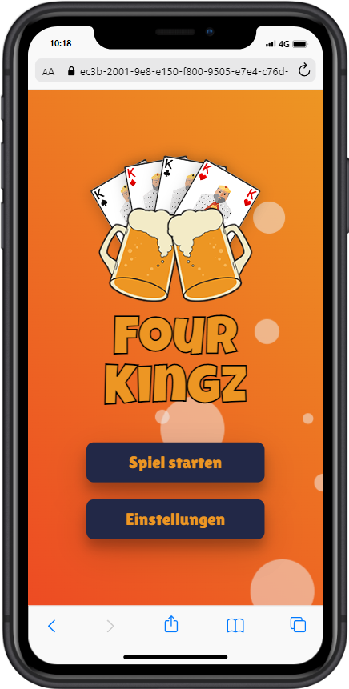
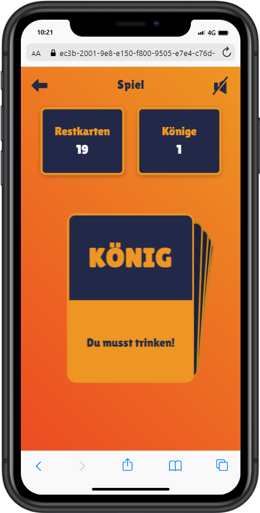
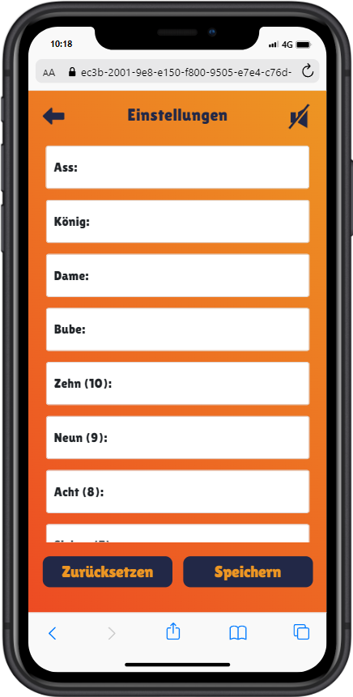

# Card drinking game
## Explanation:

<p>The drinking game uses a Skat card deck, where each player draws a card one after another. Each card value, such as Jack, Ace, or Ten, is associated with a specific action. <br>These actions can also be customized. The player who's turn it is must perform the action associated with the card drawn. The game ends once the **fourth King** has been drawn.</p>
&nbsp;

# UI Design

## <p><ins>Menu</ins></p>

<p>
    
</p>

## <p><ins>Game</ins></p>
<p>
    
</p>

## <p><ins>Settings</ins></p>
<p >
    
</p>

# *Project setup*
---
```
npm install
```

### Compiles and hot-reloads for development
```
npm run serve
```

### Compiles and minifies for production
```
npm run build
```

### Lints and fixes files
```
npm run lint
```

### Customize configuration
See [Configuration Reference](https://cli.vuejs.org/config/).
